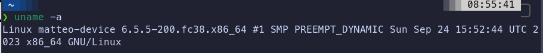
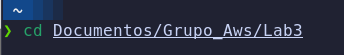
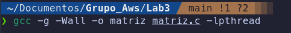
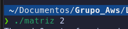
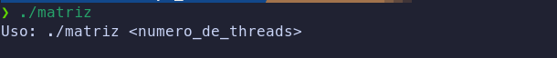
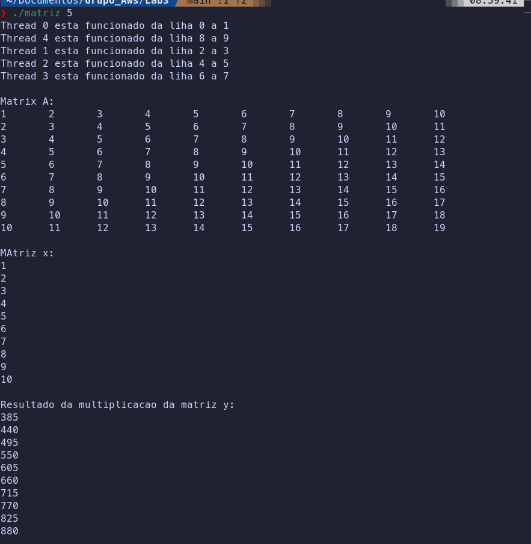

# Grupo_Aws
É o grupo Milf Hunters Sistemas Operacionais

# Integrantes

- Matteo Domiciano Varnier
- Felipe Mazzeo Barbosa
- Daniel Reis Raske

## Software

# Compilar
1. Clone o repositorio com o seguinte comando:
    https://github.com/Bobertkiller/Grupo_Aws.git
2. Acesse a pasta onde foi escolhido para dar o clone do git. Use `cd` para acessar a pasta.

    *Exemplo*:

    

    ***feito no prompt de comando do linux***
3. Digite `gcc` para poder compilar o codigo

    *Exemplo*:

    

    ***feito no prompt de comando do linux***
3. Digite `./nome do arquivo` para poder rodar o codigo e o numero de thread que deseja ser executada

    *Exemplo*:

    

    ***feito no prompt de comando do linux***

# Print do output

### Output sem colocar a quantidade de thread

###  Output 1 indo com 5 threads

