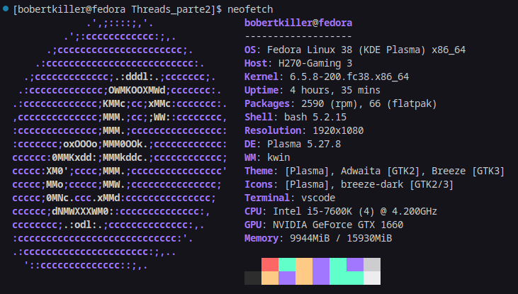
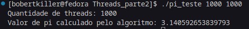
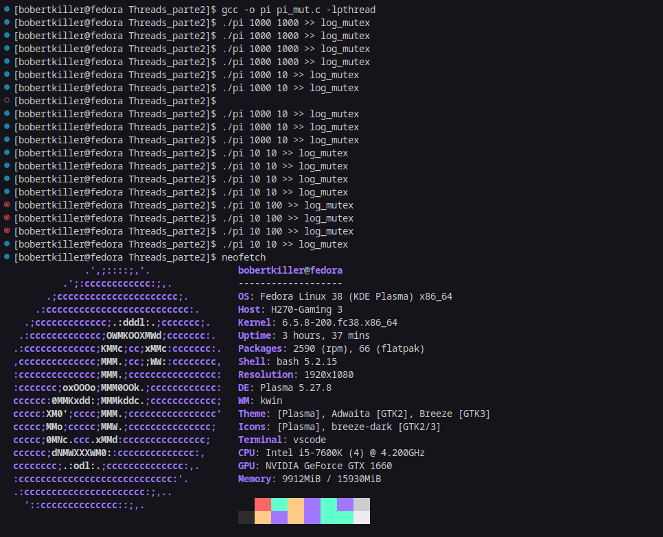
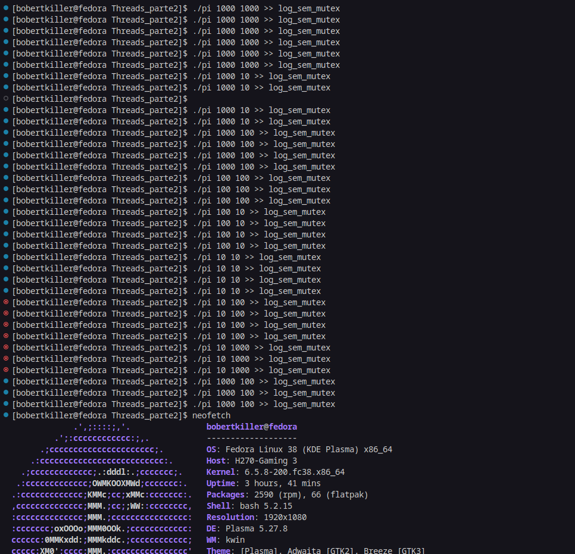

# Grupo_Aws
É o grupo Milf Hunters Sistemas Operacionais

# Integrantes

- Matteo Domiciano Varnier
- Felipe Mazzeo Barbosa
- Daniel Reis Raske

## Software

## Arquivos

- `pi_mut.c`: É o código fonte do execicio utilizando mutex.
- `log_mutex`: É o log do código do arquivo `pi_mut.c`.
- `pi.c`: É o código fonte do execicio sem utiliza mutex.
- `log_sem_mutex`: É o log do código do arquivo `pi.c`.

# Compilar
1. Clone o repositorio com o seguinte comando:
    https://github.com/Bobertkiller/Grupo_Aws.git
2. Acesse a pasta onde foi escolhido para dar o clone do git. Use `cd` para acessar a pasta.

    *Exemplo*:

    

    ***feito no prompt de comando do linux***
3. Digite `gcc -o <nome.out> <nome_do_arq.c> -lpthread ` para poder compilar o codigo (nome.out é o nome desejado para o arquivo compilado)

    *Exemplo*:

    

    ***feito no prompt de comando do linux***
3. Digite `./nome do arquivo <n> <num_thread>` para poder rodar o codigo, sendo `n` a quantidade de somas da série e `num_thread` a quantidade de thread desejados para realizar a operação.

    *Exemplo*:

    

    ***feito no prompt de comando do linux***

## Tarefa
- A função utilizada para calcular π (pi) nas implementações é chamada `Thread_sum` Esta função é executada por cada thread e é responsável por calcular uma parte da estimativa de π usando a Série de Leibniz.
- Cada thread calcula uma parte da soma total da série de Leibniz, e a soma total dessas partes é usada para estimar o valor de π. A variável compartilhada `sum` é protegida por um mutex na implementação que utiliza mutex para evitar condições de corrida e garantir que as threads atualizem `sum` de forma segura.

## a)
- **Sem Mutex :** Nesta solução, as threads estão calculando partes diferentes da série sem sincronização explícita entre elas. Cada thread atualiza a variável `sum` sem considerar outras threads que podem estar fazendo o mesmo. O que pode levar a condições de corida e a resultados inconsistentes, ficando cada vez mais inconsistente quanto maior for o número de threads.

- **Com Mutex :** Nesta solução,um mutex foi introduzido para proteger a variável compartilhada `sum`. O que acaba "barrando" os threads, ou seja, apenas uma thread de cada vez pode adquirir o mutex e, portanto, atualizar `sum`. Isso garante que não haja condições de corrida e que o resultado final seja consistente, independentemente do número de threads.

- **Comparação :** A solução com mutex é mais segura e robusta em termos de evitar condições de corrida e garantir resultados consistentes, independentemente do número de threads. 

## b)
- As causas por tas dos resultados divergentes dos algoritimos podem ser explicados por:

1) **Série de Aproximação :** As soluções implementadas usam uma série de aproximação para calcular π. A série utilizada é uma série infinita que converge para o valor de π, mas ela requer um número infinito de termos para atingir a precisão exata de π. Quanto mais termos você usar na série, mais precisa será a estimativa, mas ela nunca será exata com um número finito de termos.

2) **Arredondamento e Precisão Limitada :** Em operações de ponto flutuante, há limitações de precisão. Os números em ponto flutuante são aproximados, e à medida que você realiza operações matemáticas, erros de arredondamento podem ocorrer. Mesmo com um número grande de termos na série, os erros de arredondamento acumulados podem impedir que o resultado seja exatamente igual a π.

3) **Eficiência e Escalabilidade :** As soluções também dependem da eficiência e escalabilidade do cálculo. Ao dividir o trabalho entre várias threads, pode haver variações na ordem de cálculo, o que pode afetar ainda mais a precisão.

## Logs
- Os logs são gerados na hora que se roda o programa compilado da seguinte forma:

    *Exemplos*
    

    

- Nesses exemplos o arquivo `c` foi compilado para o nome pi quando se fez os testes, os exemplos acima podem ser distinguidos pelo nome do log sendo o primeiro exemplo da solução utilizando Mutex.