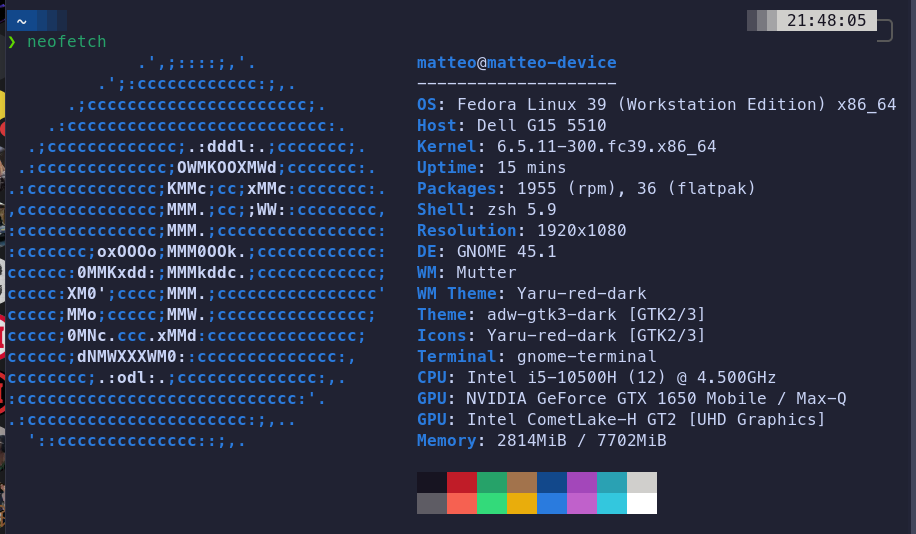

# Grupo_Aws
É o grupo Milf Hunters Sistemas Operacionais

# Integrantes

- Matteo Domiciano Varnier
- Felipe Mazzeo Barbosa
- Daniel Reis Raske

# Sobre o Projeto

Nesse projeto tivemos o desafio de solucionar um problema de uma escada rolante dupla, aonde somente uma escada rolante sobe e desce.

O codigo pode quantas pessoas estaram na escada rolante. 
Ao a primeira pessoa entrar, ele ira verificar se a proxima pessoa que esta chegando ira para a mesma posicao ou nao.

Se a pessoa for ao mesmo lado, a escada rolante sobe e com isso so somamos 10 na ultima pessoa da escada

Se a pessoa for para o outro lado, o codigo bloqueia essa pessoa e faz com que a espere que todos cheguem ao outro lado para a pessoa atravessar. 

# Sistema Operacional

## Compilar
1. Clone o repositorio com o seguinte comando:
    https://github.com/Bobertkiller/Grupo_Aws.git
2. Acesse a pasta onde foi escolhido para dar o clone do git. Use `cd` para acessar a pasta.

    *Exemplo*:

    

    ***feito no prompt de comando do linux***
3. Digite `gcc` para poder compilar o codigo

    *Exemplo*:

    

    ***feito no prompt de comando do linux***
3. Digite `./nome do arquivo` para poder rodar o codigo

    *Exemplo*:

    

    ***feito no prompt de comando do linux***
# Testes de mesa
###  Teste de mesa com 5 pessoas

###  Teste de mesa com 10 pessoas 

### Teste de mesa com 100 pessoas

